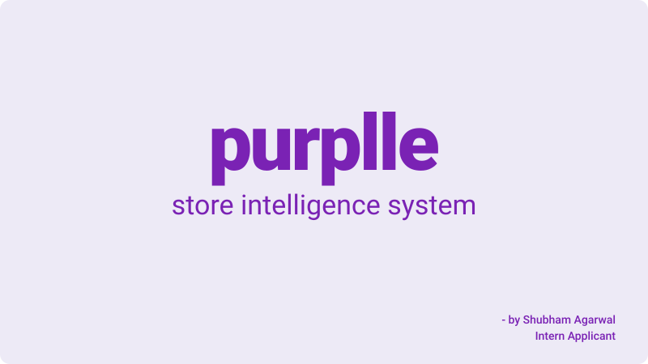

# Store Intelligence API


<p align="left">
  
</p>

**Purplle Tech Challenge 2026 — Offline Store Analytics Pipeline**

Converts raw CCTV footage into real-time retail business metrics.
Processes 5 camera feeds → structured events → REST API → live dashboard.

---

## Quick Start (5 commands)

```bash
git clone <your-repo-url>
cd store-intelligence
cp /path/to/pos_data.csv data/Brigade_Bangalore_10_April_26.csv
docker compose up --build
curl http://localhost:8000/health
```

The API starts on `http://localhost:8000`. Interactive docs at `/docs`.

---

## Running the Detection Pipeline

### Prerequisites
```bash
python -m venv venv
# Windows:
.\venv\Scripts\Activate.ps1
# Mac/Linux:
source venv/bin/activate

pip install -r pipeline/requirements.txt
```

### Place your clips
Set up your local data folder and assign your video streams according to the camera layout below:

| Video Feed File | Targeted Store Zone | Pipeline Behavior / Logic |
| :--- | :--- | :--- |
| `data/clips/cam1.mp4` | 🚪 Entry / Exit | Triggers `ENTRY`/`EXIT` events & initializes Re-ID |
| `data/clips/cam2.mp4` | 💄 Makeup + Skin | Tracks customer dwell-time and category interaction |
| `data/clips/cam3.mp4` | 🧼 Bath & Body + Hair | Tracks customer dwell-time and category interaction |
| `data/clips/cam4.mp4` | 📦 Back Room | **Auto-skipped** by the detection pipeline configuration |
| `data/clips/cam5.mp4` | 💳 Billing Counter | Tracks queue spikes and maps to POS checkout |

> 💡 **Configuration Note:** Update `clip_start_time` in `pipeline/config/store_layout.json` to match the exact timestamp watermark visible in each video clip.

### Run detection

```bash
# Windows
.\pipeline\run.ps1

# Mac/Linux
bash pipeline/run.sh
```

Or manually initialize the pipeline script:
```bash
python pipeline/detect.py \
  --clips  data/clips \
  --output data/events.jsonl \
  --layout pipeline/config/store_layout.json \
  --api    http://localhost:8000
```
## Running Store 2 (ST1076 — Mumbai)

```bash
python pipeline/detect.py \
  --clips  data/clips2 \
  --output data/events_store2.jsonl \
  --layout pipeline/config/store2_layout.json \
  --api    http://localhost:8000
```

Note: The script automatically downloads yolov8m.pt (~50MB) directly to the root folder on its first initialization.

> [!NOTE]
> **Data Limit Note for Store 2 (ST1076):** Conversion rate and purchase-related metrics will be 0.0 because there is no corresponding POS transactions CSV (`pos.csv`) provided for Store 2. Only the computer-vision tracking metrics (dwell times, visits, and queues) are active.


### Load POS transactions
```bash
python pipeline/pos_loader.py data/Brigade_Bangalore_10_April_26.csv
```

---

## Live Dashboard

We provide both a terminal-based UI and a premium browser-based dashboard.

### 🌐 Option 1: Web Dashboard (Recommended)
FastAPI serves a responsive, modern web dashboard directly at:
👉 **[http://localhost:8000/dashboard](http://localhost:8000/dashboard)**

It features:
- **Purplle Brand Theming**: A beautiful, eye-friendly sweet lavender theme tailored with soft borders and colors to match Purplle's visual identity.
- **Live Auto-Refresh**: Pulls the 5 backend API endpoints (metrics, funnel, heatmap, anomalies, health) every 3 seconds with animated transitions.
- **Store Floor Map**: A color-coded zones grid visualizer showing visit counts and average dwell times.
- **Zero Dependencies**: Pure HTML/CSS/Vanilla JS — no heavy bundlers or build steps. You can also run it by simply double-clicking `dashboard/index.html`!

### 💻 Option 2: Rich Terminal Dashboard
Start the terminal dashboard while the API is running:

```bash
pip install rich
python dashboard/live.py
```

To replay previously processed events in simulated real-time and watch the live updates:
```bash
# Terminal 1 — Replay events to the API
python dashboard/replay.py --input data/events.jsonl --speed 20

# Terminal 2 — Run the terminal dashboard (or keep the Web dashboard open!)
python dashboard/live.py
```

---

## API Endpoints

| Method | Endpoint | Description |
|--------|----------|-------------|
| `POST` | `/events/ingest` | Ingest detection events (batch ≤500, idempotent) |
| `GET` | `/stores/{id}/metrics` | Visitors, conversion rate, zone dwell |
| `GET` | `/stores/{id}/funnel` | Entry → Zone → Billing → Purchase |
| `GET` | `/stores/{id}/heatmap` | Zone visit frequency, normalised 0–100 |
| `GET` | `/stores/{id}/anomalies` | Queue spikes, conversion drops, dead zones |
| `GET` | `/health` | DB status, per-store feed freshness |
| `POST` | `/pos/load` | Load POS transaction CSV |

Target Store ID for Evaluation: `ST1008` (Brigade Bangalore)

Example:
```bash
curl http://localhost:8000/stores/ST1008/metrics
curl http://localhost:8000/stores/ST1008/funnel
curl http://localhost:8000/stores/ST1008/heatmap
curl http://localhost:8000/stores/ST1008/anomalies
```

---

## Architecture

```mermaid
graph LR
    %% Data Sources
    Clips[CCTV Video Clips] --> Vision[YOLOv8m + ByteTrack Engine]
    POS[POS Transaction CSV] --> Ingest[POS Loader Module]

    %% Pipeline Processing
    Vision -->|Structured Events| JSONL[(events.jsonl)]
    JSONL --> API[FastAPI Backend Engine]
    Ingest --> API

    %% Storage & Access
    API --> DB[(SQLite store.db)]
    API --> Dash[Live Rich Dashboard]

    style Vision fill:#4d0101,stroke:#333,stroke-width:2px
    style API fill:#00005e,stroke:#333,stroke-width:2px
    style DB fill:#005400,stroke:#333,stroke-width:2px
```



The vision architecture executes through five core logical stages:
1. Person Detection — YOLOv8m base tracking (class=person, conf ≥ 0.35).
2. Tracking — ByteTrack management (persist=True, dynamic IoU=0.3 for dense group handoffs).
3. Classification — Dynamic HSV-space staff uniform detection mapped with a long-presence heuristic.
4. Event Emission — State machine tracking engine emitting structural ENTRY, EXIT, ZONE, DWELL, BILLING, and REENTRY events.
5. Re-ID — Color histogram cosine similarity validation paired with a rolling 30-minute re-entry window block.

* 📖 **Engineering Rationale:** Detailed design trade-offs, performance benchmarks, and AI override justifications are documented in [`docs/CHOICES.md`](docs/CHOICES.md).
* 🏗️ **Architectural Deep-Dive:** Comprehensive system engineering layouts, database schemas, and camera topography logic are detailed in [`docs/DESIGN.md`](docs/DESIGN.md).

---

## Running Tests

```bash
python -m pytest tests/ -v --cov=app --cov-report=term-missing
```

Coverage: 81% | Tests: 25 passing

---

## Project Structure

```text
store-intelligence/
├── app/                     # FastAPI backend application
│   ├── __init__.py          # Package initializer
│   ├── anomalies.py         # /anomalies endpoint
│   ├── database.py          # Database session and connection setup
│   ├── funnel.py            # /funnel endpoint
│   ├── health.py            # /health endpoint
│   ├── heatmap.py           # /heatmap endpoint
│   ├── ingestion.py         # /events/ingest endpoint
│   ├── main.py              # App entrypoint + middleware
│   ├── metrics.py           # /metrics endpoint
│   ├── models.py            # Database/Data validation models
│   └── pos.py               # /pos/load endpoint
├── dashboard/               # Live analytics dashboards
│   ├── __init__.py          # Package initializer
│   ├── index.html           # Web dashboard (lavender theme with Purplle branding)
│   ├── live.py              # Terminal dashboard (Rich-based)
│   └── replay.py            # Event replay at simulated speed
├── data/                    # Local data storage(Directory excluded from Git)
│   ├── clips/               # Raw video footage for the vision pipeline
│   │   └── *.mp4            # Store camera feeds (5 target camera streams)
│   ├── Brigade_Bangalore_10_April_26.csv   # Local Point-of-Sale ingestion data
│   ├── events.jsonl         # Buffered downstream event logs
│   |── store.db             # Target engine SQLite file (metrics & tracking state)
│   ├──clips2/
│   │  └── *.mp4            # 2nd store videos
│   └──events_store2.jsonl  # Events from Store 2
├── docs/                    # Project documentation
│   ├── banner.svg           # Project banner
│   ├── CHOICES.md           # Architecture and design trade-offs
│   |── DESIGN.md            # System design details
|   └── nce.git
├── pipeline/                # Computer Vision & Detection pipeline
│   ├── config/
│   │   └── store_layout.json  # Spatial configuration for zone tracking
│   ├── detect.py            # Main frame processing and YOLO inference
│   ├── emit.py            # Event schema builder
│   ├── pos_loader.py        # POS CSV data ingestion
│   ├── staff.py             # Staff vs. customer classification logic
│   ├── tracker.py           # Object tracking and Re-ID management
│   └── zones.py             # Zone allocation and entry-line crossings
├── tests/                   # Test suite
│   ├── __init__.py          # Package initializer for test module
│   ├── conftest.py          # Pytest fixtures and environment setup
│   ├── test_anomalies.py    # Tests for anomaly detection logic
│   ├── test_ingestion.py    # Tests for data ingestion pipeline
│   ├── test_metrics.py      # Tests for analytical metrics
│   └── test_pipeline.py     # Tests for core vision tracking pipeline
├── .dockerignore            # Files excluded from Docker builds
├── .gitignore               # Files excluded from Git tracking
├── docker-compose.yml       # Multi-container orchestration config
├── Dockerfile               # Application containerization recipe
├── requirements.txt         # Python dependencies (includes FastAPI,    Uvicorn, Rich)
└── yolov8m.pt               # Pre-trained YOLOv8m object detection weights
```

The data/ directory tracks local state and source assets. Because it contains heavy binary files and databases, its contents are omitted from Git tracking. To run the project locally:
1. Ensure the data/ and data/clips/ directories exist at the root.
2. Drop your source video streams (.mp4 format) into data/clips/.
3. Provide the necessary Brigade_Bangalore_10_April_26.csv to feed the POS ingestion pipeline (I renamed the original .csv file to this to match what I used in pipeline).
4. The underlying runtime state machine automatically handles generation schemas for store.db and downstream events.jsonl buffers upon bootstrap execution.
