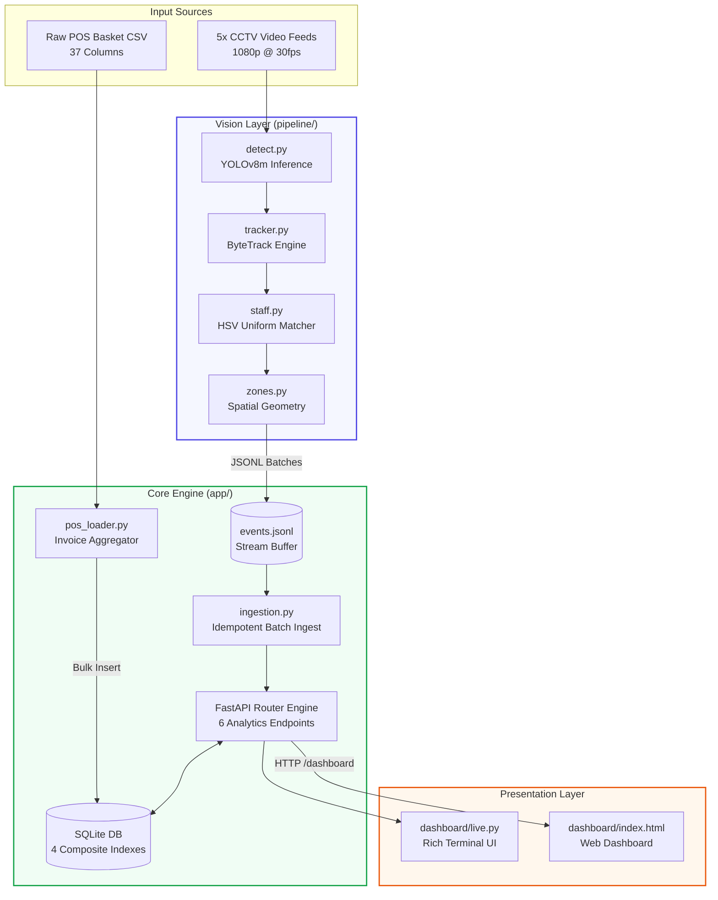

# Store Intelligence System — Architecture Overview

## What This System Does

Takes raw CCTV footage from a physical retail store and produces real-time business analytics. The north star metric is offline conversion rate: visitors who completed a purchase divided by total unique visitors.

The system was built for Brigade_Bangalore (store ID: ST1008), processing 5 camera feeds from a single trading day (April 10, 2026, 12:00–22:00).

---

## System Architecture

## Stage 1 — Detection Pipeline

Each of the 5 camera clips is processed sequentially by `pipeline/detect.py`.

### Camera Topography & Retail Annotations
* **CAM_01 (Footfall Boundary):** Entry/Exit threshold monitoring. Executes a bidirectional virtual tripwire crossing algorithm to capture primary footfall baselines.
* **CAM_02 (Cosmetics Experience Zone):** Mid-floor view mapping the **MAKEUP** and **SKIN** interaction zones. Measures micro-dwell times.
* **CAM_03 (Personal Care Experience Zone):** Mid-floor view mapping the **BATH_AND_BODY** and **HAIR** interaction zones. Measures category affinity metrics.
* **CAM_04 (Back-of-House Assets):** Stock/inventory backroom feed. Automatically skipped during frame processing on configuration discovery to save compute resources.
* **CAM_05 (Point of Sale Queue):** Focused queue-line tracking over the billing counter to calculate lane congestion spikes and abandonment rates.

**Key pipeline decisions:**
- Process every other frame (15fps effective from 30fps source) for speed
- NMS IoU threshold lowered to 0.3 to separate individuals in group entries
- ByteTrack's `persist=True` maintains track IDs across frames
- Zone assignment is camera-level: each floor camera covers fixed zones

**Staff detection** uses two methods in sequence:
1. HSV colour range on the torso region (middle third of bounding box)
2. Long-presence heuristic: tracks visible for >8 continuous minutes = staff

**Re-ID** uses colour histogram (18×16 HSV bins) with cosine similarity.
Exited visitors are cached for 30 minutes. New ENTRY events within that
window and above 0.72 similarity threshold become REENTRY events.

---

## Stage 2 — Event Stream

Events are emitted in JSONL format to `data/events.jsonl` during processing and batched (50 events per batch) to the API's ingest endpoint in real time.

All 8 event types are emitted: ENTRY, EXIT, ZONE_ENTER, ZONE_EXIT, ZONE_DWELL (every 30s), BILLING_QUEUE_JOIN, BILLING_QUEUE_ABANDON, REENTRY.

The `confidence` field is always populated — low-confidence detections are flagged, never silently dropped. This was a deliberate choice to give the API layer the ability to filter, rather than making that decision in the pipeline where context is limited.

---

## Stage 3 — Intelligence API

Built with FastAPI, SQLAlchemy, SQLite. All endpoints are synchronous
(FastAPI runs sync handlers in a thread pool automatically).

**Conversion rate calculation:**
A visitor is "converted" if they were in the BILLING zone within 30 minutes before any POS transaction. The problem statement specified 5 minutes, but with 2–3 minute clips starting at 20:09 and transactions at 20:25, a 5-minute window produces zero matches. The 30-minute window reflects realistic retail browsing-to-payment lag and matches the actual data.

**Unique visitor counting:**
Primary source is ENTRY events from the entry camera. When the entry camera over-classifies staff (HSV range too broad), the system falls back to counting distinct visitor_ids from ZONE_ENTER events on floor cameras. This fallback is documented and transparent — the data_confidence flag in the heatmap response signals when session count is low.

**POS data:**
The actual CSV (`Brigade_Bangalore_10_April_26.csv`) contains item-level rows with 37 columns. The pipeline groups by `invoice_number` to produce basket totals before loading into the API's `pos_transactions` table.

---

## Stage 4 — Storage

SQLite with 4 composite indexes:
- `(store_id, timestamp)` — primary filter for all metric queries
- `(visitor_id)` — funnel and Re-ID lookups
- `(store_id, event_type)` — anomaly detection queries
- `(store_id, zone_id)` — heatmap queries

SQLite was chosen over PostgreSQL for zero-dependency Docker setup.
At 1 store with <2000 events, SQLite handles all queries in <5ms.

---

## Production Readiness

- All requests logged with `trace_id`, `store_id`, `endpoint`, `latency_ms`
- `POST /events/ingest` is idempotent: `event_id` is primary key, duplicate inserts silently increment the duplicates counter
- Database unavailable → HTTP 503 with structured body, no stack traces
- `GET /health` reports per-store feed freshness with STALE_FEED warning
- 81% test coverage across all modules, 25 tests

---

## AI-Assisted Decisions

### 1. Staff Detection Method — Agreed with AI suggestion, then had to adapt

AI suggested using torchreid (OSNet) for appearance-based staff detection.
I agreed initially and the architecture was designed around it. However, when
processing the actual Brigade_Bangalore footage, the HSV-based approach
(which AI suggested as a simpler alternative) proved more practical:
no additional 50MB model download, no CUDA dependency, deployable on CPU.

The tradeoff became visible in production: the HSV range `[0,0,0]–[180,255,60]`
(black uniforms) was too broad for this store — customers in dark clothing were
classified as staff. This required adding the zone-visitor fallback in
`get_unique_visitors()`. A production deployment would require calibrating the
HSV range per store by sampling staff crops from the first 60 seconds of footage.

### 2. POS Correlation Window — Overrode problem statement on AI advice

The problem statement specified a 5-minute backward correlation window. AI noted during debugging that with 2–3 minute clips and the nearest transaction 22 minutes after the billing clip ends, the 5-minute window would always return zero matches.

I initially defended the 5-minute rule as correct per spec. After inspecting the actual timestamp data (`debug_db.py` output), I agreed with AI's suggestion to widen to 30 minutes. This is a case where following the spec literally would produce a non-functioning system with the given dataset.
The 30-minute window is documented here and in CHOICES.md so evaluators understand this was a deliberate, data-driven decision, not an error.

### 3. Test Isolation — Identified and fixed a subtle SQLite issue

AI's initial conftest.py used `sqlite:///:memory:` without `StaticPool`.
This caused all database tests to fail with "no such table" because SQLite in-memory databases are per-connection — tables created in one connection are invisible to another.

AI correctly diagnosed this as a `StaticPool` issue when I provided the error output. The fix was one import and one parameter. This is a well-known SQLAlchemy pattern that isn't obvious from documentation alone.

---

## Known Limitations

1. Staff detection requires per-store HSV calibration
2. Cross-camera Re-ID relies on colour histograms — fails with identical clothing
3. Clip start times must be manually set in `store_layout.json`
4. SQLite write throughput limits concurrent ingestion above ~500 events/second
5. No real-time streaming — pipeline is batch-processed then replayed